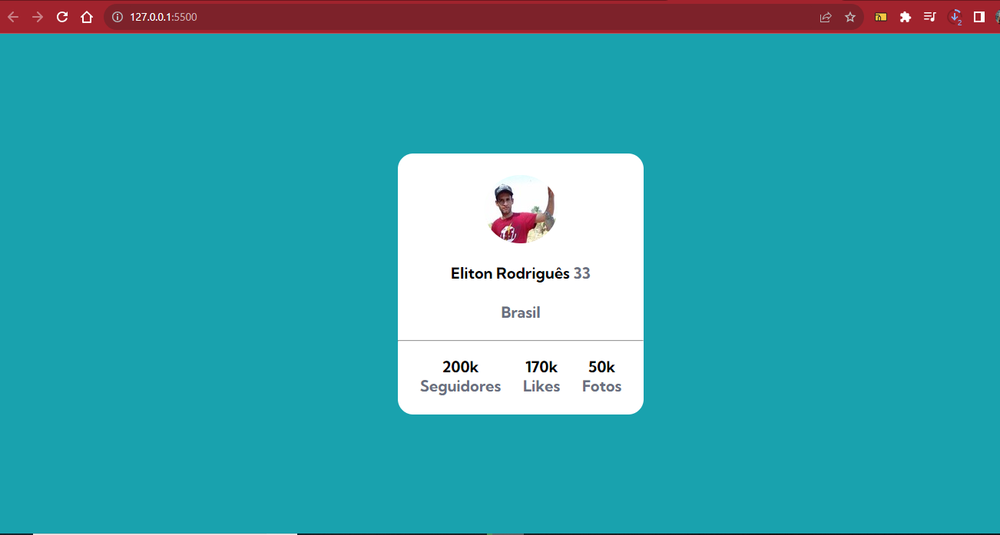

# Exercicio cartão perfil

Descrição da tarefa: Esse exercício é uma ALTERNATIVA ao desafio do frontend mentor. Onde o principal desafio é criar um cartão que contenha as informações de perfil. Para ser aprimorado as habilidades de posicionamento de elementos usando flexbox.😊👍

[]

## Tecnologias utilizadas
- HTML
- CSS

